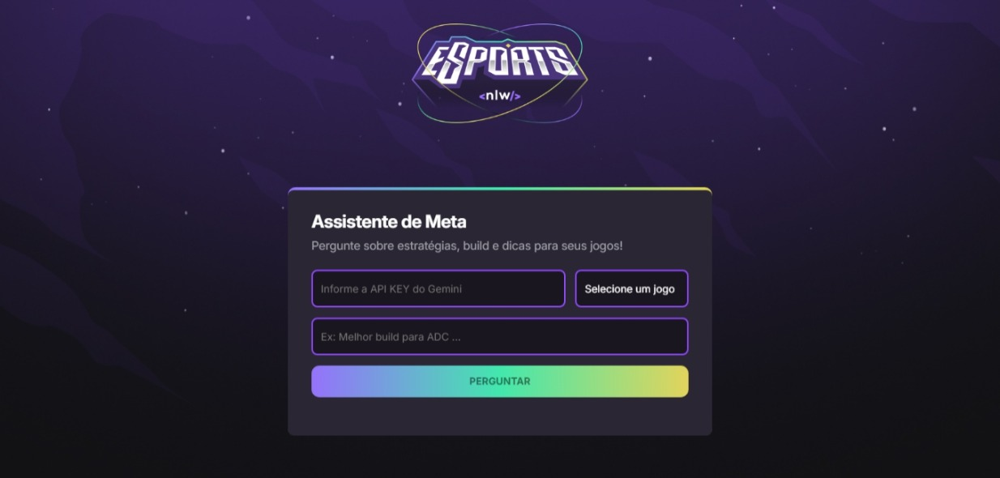

# NLW Agents Website 

  

Um site responsivo desenvolvido com HTML, CSS e JavaScript, criado como parte da trilha NLW Agents.
O projeto consiste em um design moderno e adaptável, integrações com IA do Google Gemini para responder perguntas sobre estratégias, builds e dicas em diversos jogos.  

## 🚀 Tecnologias Utilizadas

**HTML5** – Estrutura semântica e acessível.

**CSS3** – Layout responsivo e estilização avançada.

**JavaScript (ES6+)** – Funcionalidades interativas e integração com APIs.

**Google Gemini API** – Inteligência Artificial para respostas contextualizadas sobre jogos.

**Git & GitHub Pages** – Controle de versão e deploy estático.

## 🖥 Visualização

  

## 📜 Funcionalidades

Design responsivo, adaptado para dispositivos móveis e desktop.

Seleção de jogo (League of Legends, Valorant e CS:GO).

Campo de pergunta para enviar questões sobre estratégias, builds, composições e dicas.

Respostas automáticas geradas pela IA do Google Gemini.

Necessidade de API Key para uso da IA.

## 💡 Como Funciona a Integração com IA
O usuário escolhe um jogo no seletor, insere uma pergunta (ex.: "Qual a melhor build para Jinx no LoL?") e envia.
O sistema usa a Google Gemini API para processar a solicitação e gerar uma resposta detalhada, levando em conta estratégias e contexto do jogo escolhido.

Exemplo de uso da API:

    javascript 
             import { GoogleGenerativeAI } from "@google/generative-ai";

              const API_KEY = "SUA_API_KEY_AQUI";
              const genAI = new GoogleGenerativeAI(API_KEY);
              
              async function gerarResposta(jogo, pergunta) {
                const model = genAI.getGenerativeModel({ model: "gemini-pro" });
                const prompt = `Você é um especialista no jogo ${jogo}. Responda à pergunta: ${pergunta}`;
                const resultado = await model.generateContent(prompt);
                return resultado.response.text();
              }  

## ⚙️ Execução Localmente

1. **Clone o repositório**
 
        git clone https://github.com/seu-usuario/seu-repositorio.git

2. **Acesse a pasta do projeto**

        cd seu-repositorio

3. **Configure sua API Key**

Crie um arquivo config.js (não envie para o GitHub) contendo:

    javascript
        export const API_KEY = "SUA_API_KEY_AQUI";

4. **Abra index.html no navegador ou use a extensão Live Server no VS Code.**

# 🌐 Deploy
O projeto está disponível em:
🔗 https://eduarda-ferr.github.io/Trilha-NLW-Agents/
